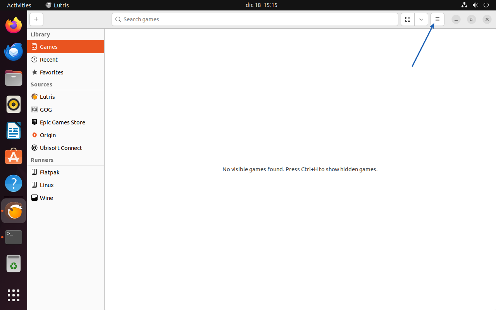
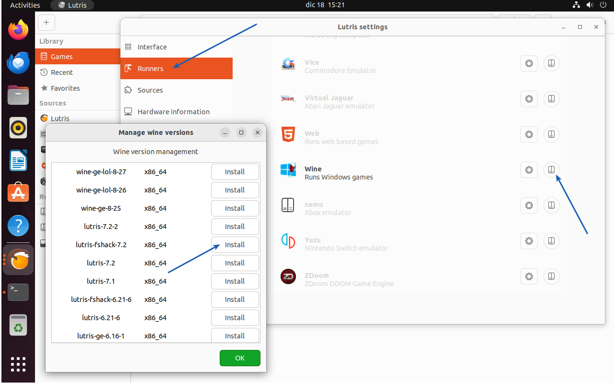
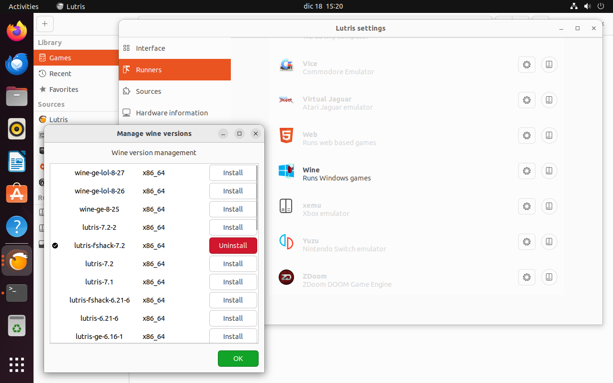
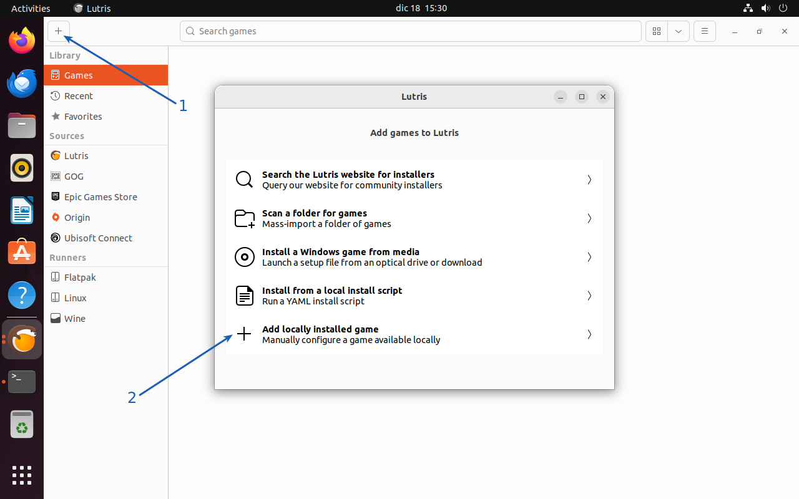
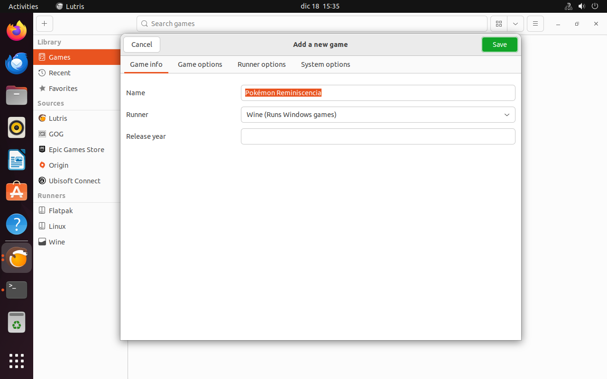
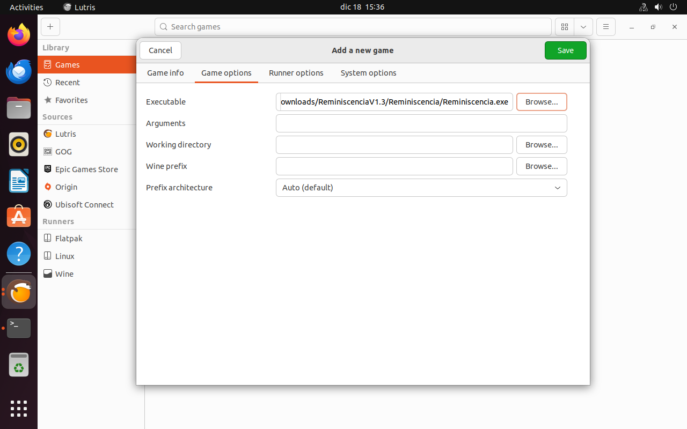
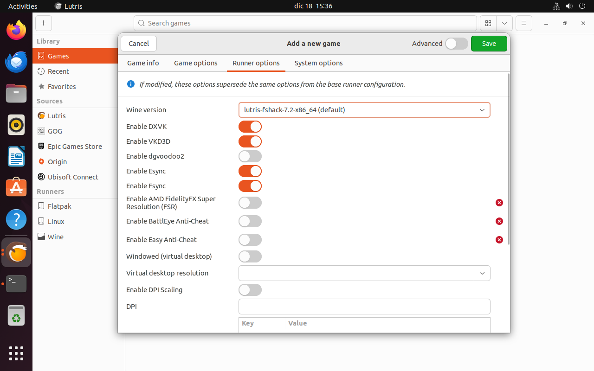
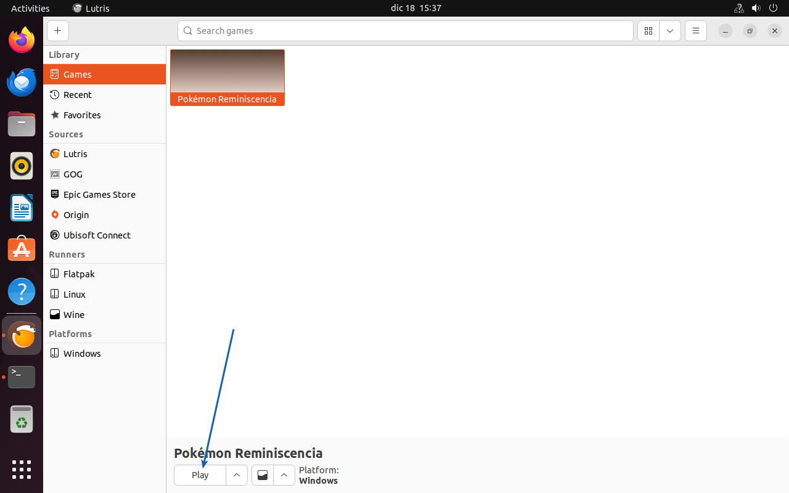
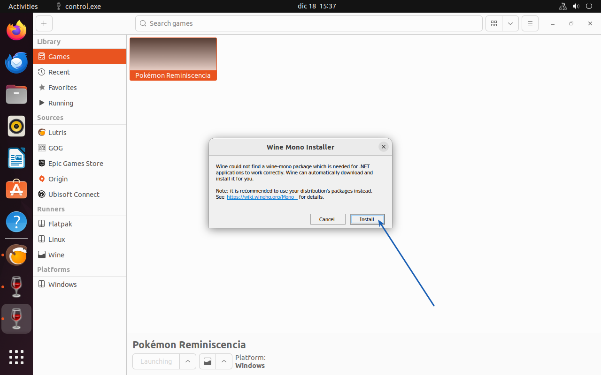
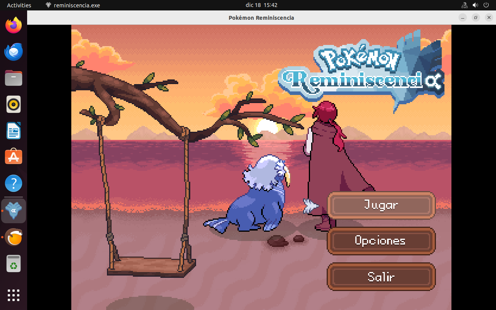

# Easily install Pokémon Reminiscencia on your Linux machine


First, download the latest version of the game [here](https://phiongames.blogspot.com/2023/10/descargar-pokemon-reminiscencia.html). You need to choose between different applications to run this game on your computer (my recommendation is **Lutris**).

Then, open your command line and start typing the following commands and following those steps.

## Using Lutris

### 1. Install Lutris

Choose your commands based on your operating system.

```bash
# On Debian and Ubuntu based distributions:
sudo add-apt-repository ppa:lutris-team/lutris
sudo apt update && sudo apt install lutris

# On Fedora Workstation
sudo dnf install lutris

# On Arch Linux based distributions:
sudo pacman -S lutris

# To install it from Flathub:
flatpak install flathub net.lutris.Lutris
```

_Please note, you can skip this step if you already installed Lutris in the past._

### 2. Run Lutris

Open Lutris, if it's your first time you will see your library empty. If not, you will see the rest of your library among this new game after finishing these steps.



### 3. Download dependencies

We will need to download the `lutris-fshack-7.2` runner. To do this, enter to `Preferences > Runners` and click in the second icon in the `Wine` runner.



Then, wait until the download finish and come back to the main view closing all these windows.



### 4. Add a new game to Lutris

Click on the left-top corner plus icon to add a new game. Then, select the `Add locally installed game`.



A new window with 4 different tabs will show up, enter to these three different tabs `Game info`, `Game options` and `Runner options` to set the settings below. When you're done, press the save button.





_Please note, other runners and settings might also work. But these are tested by me and they work flawlessly with this game._

### 5. Play the game

You will be in front of your copy of Pokémon Reminiscencia in seconds, press the play button.



First time you run the game, you may be asked to download some dependencies. Install them and wait until they are installed.



_Please note, the game can crash right after this last dependency installation but don't worry. Relaunch the game and it will work perfectly fine from now on._



## Contribute

Pull requests are welcome. For major changes, please open an issue first to discuss what you would like to change.

## Credits

I want to really thank [@alfpixel](https://twitter.com/alfpixel) and [@pkmn_realidea](https://twitter.com/pkmn_realidea) for this awesome fangame and their hard work. Keep doing this please! 🫶

## License

[MIT](https://choosealicense.com/licenses/mit/)
